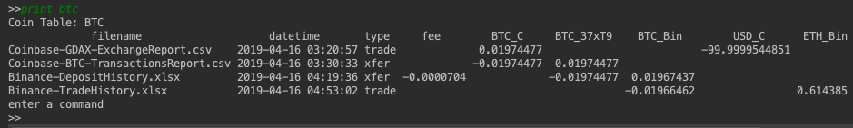
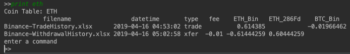

# cryptoAssetTracker
## Project Prerequisites
The project is written in python and require the use of the following libraries which will need to be installed: Blockcypher and openpyxl.

Python > 3.6.7
Install Blockcypher using command > `pip3 install blockcypher`

Install openpyxl using command > `pip3 install openpyxl`

To run the sample database > `python3 cryptoTracker.py exchangeFiles.csv`

## Introduction
This project was created to provide an open source project to help individuals privately and confidentially manage and track their crypto assets.  There are 3rd party providers for this service but unfortunately, you’d need to share your crypto exchange accounts/passwords and your public keys.  These services are not cheap and this is an invasion of a person privacy and an additional security risk.

There is a big push among crypto hobbyists to take ownership of their crypto asset by managing their private wallets on the public blockchain. There is a saying in the community “not your keys, not your coin.”  Many individuals have lost their crypto assets because of security hacks on their trusted exchange.  The most notorious examples include Mt Gox, Quadriga, and the most recent Bitfinex.    As long as hobbyists’ private keys are secured, storing your assets on the public blockchain is a sound approach for security and access. When managing your private keys, the reporting and tracking of assets now needs to be manage by the individual. 

## Project Concept
The project goal is to use reports generated by your crypto exchange and data from the public blockchains to generate a comprehensive list of hobbyist assets.  Initially the project supports two coins (Ethereum and Bitcoin) and two exchanges (Binance and Coinbase).  No crypto exchange passwords or private keys are required by this project.

Figure 1: Notional Project flow
The project reads the data from the exchange reports, generates a SQLITE database of the assets and uses the transaction hash in the exchange reports to generate a list of transactions and wallets possibly associated with the hobbyist’s assets.  Some interaction (disposition) by the hobbyist is required so the public blockchain data can be appropriately added to the database.  Reports can be generated on the individual coin asset or database.  A notional flow diagram of this project is shown in Figure 1.

An example crypto currency transaction was created to help test and allow the hobbyist to understand the inputs to the project and generated outputs.  The sample transaction is included with the source code and a diagram of the transactions are shown in Figure 2.

Figure 2: Sample Crypto Transactions
## Hash Table
| SHA-1 Sum                              | Location/Filename                                  |
|:---------------------------------------|:---------------------------------------------------|
|fad1d305ccfb7eb4c7ddcf97df19a07fbeab825b|./exchangeFiles.csv|
|51d9eb8d7139121b2cc851a337729ea96107e00b|./cryptoTracker.py|
|cabea3ba93f3b4032fc23480c0c1ebec8b57aa7b|./modules/cryptoTrackerEth.py|
|1af07e1d6deec3449ee45265b9794d117d568f9e|./modules/cryptoTrackerUtil.py|
|e1734ffcb199a39b971b360da6cfa130665f1fbe|./modules/cryptoTrackerBtc.py|
|7c86b84058d01280280b8a0637e19be6658ce3bd|./modules/cryptoTrackerBinance.py|
|b49cfb3eca8f785bbe582cface86e72d77eaec21|./modules/cryptoTrackerCoinbase.py|
|71e319ba79f8d59e8c8d4b656e0c565f0cd859a1|./sampleDatabase/Coinbase-BTC-TransactionsReport.csv|
|0af1413893f745b124160b03a6a5ce5f2111189b|./sampleDatabase/Binance-DepositHistory.xlsx|
|88c08a1479d727014512e412022636042951ee64|./sampleDatabase/Coinbase-GDAX-ExchangeReport.csv|
|06109d22cb4012ab2a4b4cb2e7e39d9c69daaab5|./sampleDatabase/Binance-WithdrawalHistory.xlsx|
|ea15b1f2f3e4ae357a816235e310a4c04a404a7d|./sampleDatabase/Binance-TradeHistory.xlsx|

## Project Inputs
There are 4 types of input for this project:
### 1. Crypto Exchange Reports

Coinbase: At least two reports are required.  The GDAX report which includes all trade history and a report on the individual coin which includes the blockchain transaction hash.  The reports can be generated on the Coinbase user page using menu “Tools > Report > Trading history (pro, prime, GDAX)>”  and “Tools > Report > Transaction History (Wallet Coin)>” where Coin is either Ethereum or Bitcoin. 

Binance: At least three reports are required.  The Transaction History report contains all the trading information but not the deposit or withdrawal information on the user’s account. The reports can be generated on the Binance user page using menu  “Funds > Transaction History > Export Complete Trade History >,” “Funds > Deposit > view all > Export Complete Deposit History >,” and “Funds >  Withdrawal  > view all > Export Complete Withdrawal History >.” The deposit and withdrawal reports include the transaction id and downloaded as a csv file but are not csv files.  These files are renamed with an xlsx extension.

### 2. File list
A file which includes a list of all the exchange file and filetype associated.  See the example file (exchangeFiles.csv) in repository for the sample crypto transactions.

### 3. Blockcypher API
Blockcipher API is used to access public blockchain information for both Ethereum and Bitcoin

### 4. Hobbyist input command(Disposition,Print)

This impact how blockchain data is added to the crypto database table or prints database/coin tables

Disposition: The searching of the public blockchain will generate a list of transactions and address suspected to be associated with the hobbyist’s account.  It is up to the hobbyist to disposition the items so they can be appropriately added to the crypto database table. The currently supported disposition commands include: wallet, purchase, donate, expense.  The syntax is as follows “disposition <command> <id No.>” where <command> is one of the commands listed above and the <id No.> is the id value associated with the wallets database. Example “disposition wallet 2.1”

Print: Prints the database table or transaction associated with the coin.  The syntax is as follows: “print <coin or database>” where <coin or database> is the name of either a coin (BTC or ETH) or database table (wallet or crypto).  Example “print ETH”.

## Processing
There are primarily 3 processing operations in the project.
1.	Data from Crypto Exchanges are consolidated into a database table (crypto).  This database table forms the basis for assets that are tracked.
2.	The project uses Blockcypher’s API to access on chain data for both Bitcoin and Ethereum.  Meta data from the Crypto Exchanges are used to identify possible transactions and wallets associated with the hobbyist. I found that Blockcypher’s API was the simplest to use and returned all the data required to track the crypto asset.  However with Blockcypher, the hobbyist is limited to 100 requests an hour.   This limitation could be an issue as the project grows.  Each new crypto asset added to this project will likely require a unique API.
3.	The blockchain is recursively searched to identify suspected assets.  Termination of the search is based on wallets behavior: 
a.	Number of transactions in a wallet
b.	Number of wallet inputs and outputs
c.	Wallet transaction is associated with a transaction reported in the database crypto table
## Outputs
There are two types of output
### 1. Database
The application generates a database.db which is a sqlite file which contains two tables: crypto and wallets.

The crypto table includes all wallets associated with the hobbyist.  It is initially generated by the Crypto exchange data but data from the blockchain search will be included in this table. The fields are as follows:
*	Filename: Include the file used for the source of the item in the row
*	Datetime: This is the UTC time reported by the crytpo exchange or blockchain for the transaction
*	Type: represents the type of transactions.  The current list of transactions include trade, xfer (transfer), donate, expense, purchase.  When processing the crypto exchange data, trade and xfer are the only types of transactions.  Donate, expense and purchase are dispositions made by the hobbyist.  These added details will be helpful for future additions to project.
*	Tx_id: transaction hash associated with a transfer.  For Binance and Coinbase transfers, the reported value is the “on chain” transaction hash.  However, other Crypto exchanges only report an “exchange” transaction hash.
*	Fee: Fees associated with transfer.
*	Wallet: Wallets are identified by starting with the crypto asset name followed by an underscore.  Wallet at exchanges are identified by a 1-3 character.  Wallets on the blockchain are identified by the first 5 characters of their blockchain address. The first character represent the coin type.

The wallets table includes all blockchain transactions possibly associated with the hobbyist.  This table is generated by the blockchain search. The fields in the table are as follows:
*	Id: It is a decimal value with periods.  Each additional decimal point represents another layer of recursion in the blockchain
*	Disposition:  Represent the wallet for which the transaction was sent or received.  A disposition is needed if this field is blank.
*	Filename:  The name of the file from which the transaction originates.
*	Coin: The crypto currency for the transaction
*	Datetime: UTC time reported by the blockchain
*	Tx_id: the transaction hash identifier that the rows source of information
*	Tx_value: the number of coins sent in the transaction
*	Wallet: the wallet associated with receiving the coins
*	Wallet_value: the current value of the wallet
*	Child: tx_ids or accounts that received coins.
*	Fee: fees associated with the transaction.

### 2. Print Database or Coin

Another output of the project is print outs.  After the program has parsed the crypto exchange data and ledger data, the hobbyist can issue command to print the database or coin transaction tables.  To print the database tables type “print crypto” at the prompt or ‘print wallets.”  These commands will print all the items in the associated database table.  In addition to printing the database, the hobbyist can print a transaction table of all the associated coins (Ethereum or Bitcoin).  The printout the sample transition are as follows:

Command “print btc” will print all the transactions associated with the BTC coin.  This include trades and transfers.  The transactions are printed in chronological order.

Command “print eth” will print all the transaction associated with ETH coin.  The includes trades and transfers of Ethereum coin.

## Future Work
This project has room to grow.  There are many aspects of the initial code drop that can be improved and my hope is this project will attract other cypto hobbyists to work on the improvements:
1.	Allow input data from a database.  Currently the application regenerates the database upon execution.  This will be an issue for hobbyists that have a large number of “on chain” transaction due to a limitation of the API used.  The API only allows 100 transactions per hour.  Since blockchains are immutable, once the information is pulled from the blockchain it shouldn’t need to be pulled again. 
2.	Support on-chain wallet to on-chain wallet transaction.
3.	Support more Crypto Exchanges
4.	Support on-chain wallet to exchange transfer (without matching tx_id).  The information contained in crypto exchange generated reports vary.  Some crypto exchanges only include an internal Tx ID.  Thus, the transfer would have to be reconciled with datetime, coin type and quantity fields in the database.
5.	Support more Coins.  There are over 2130 coins of value being traded.  Add support for the more popular blockchains: Tron, EOS, ADA, XRP, Bitcoin Cash, Litecoin and Ethereum ERC-20 tokens.
6.	Incorporate coin lot tracking (buys and sells) for tax estimation purposes.
a.	Assign fair market value on crypto to crypto asset trades base on trade date.
b.	Support like-kind exchanges of crypto assets that were allowed prior to 2018.
c.	Estimate long and short-term capital gains.
7.	Add support for retailer operators or others who provide goods or services using crypto assets.  Add features to recursively search and disposition of “receiving” TX ID.