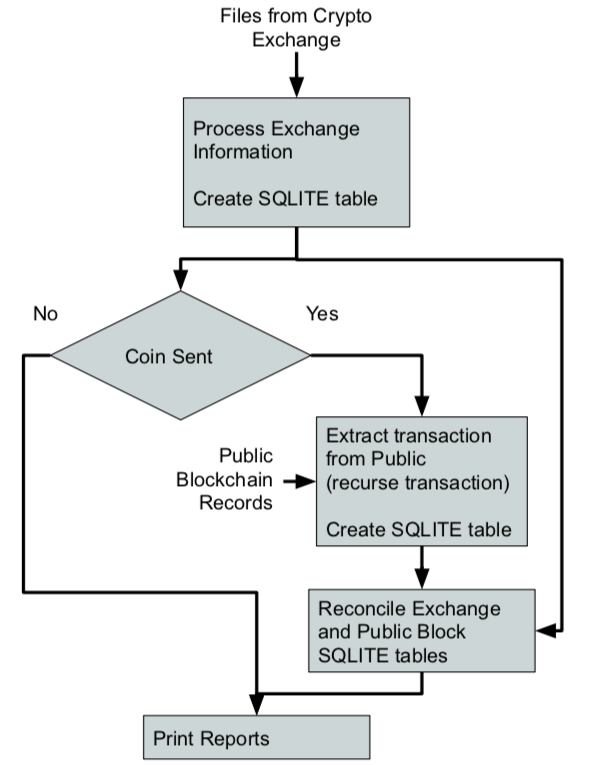
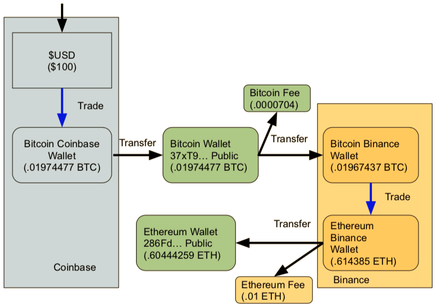

# cryptoAssetTracker
## Introduction
This project was created to provide an open source tool to help individuals private and confidentially manage and track their crypto assets.  There are 3rd party service providers but unfortunately, you’d need to share your crypto exchange accounts/passwords and your public keys.  These services are not cheap and this is an invasion of a person privacy and a possible security risk.

There is a big push in the crypto community to take ownership of their crypto asset by storing them in private wallets on the public blockchain. There is a saying in the community “not your keys, not your coin.”  Many individuals have lost their crypto assets because their trusted exchange who hold their private keys had been hacked or users have been scammed. Example of some exchange hacks include MtGox, Quadriga, and the most recent Bitfinex.    As long as your private keys are secured, storing your assets on the public blockchain is a sound approach for security and access. When managing your private keys, the reporting and tracking of assets now needs to be manage by the individual. 

The project is written in python and require the use of the following libraries which will need to be installed: Blockcypher and openpyxl.
## Project Concept
The project goal is to use reports generated by your crypto exchange and data from the public blockchains to generate a comprehensive list of your assets.  Initially the project support two coins (Ethereum and Bitcoin) and two exchanges (Binance and Coinbase).  No crypto exchange passwords or public address are required to use this tool.

The tool reads the data from the exchange reports generates a SQLITE database of the assets and uses the transaction hash in the reports to generate a list of transactions and wallets possibly associated with your assets.  Some interaction (disposition) by the user is required so the public blockchain data can be appropriately added to the database.  Reports can be generated on the individual coin asset or database.  A notional flow diagram of this tool is shown in Figure 1.

Figure 1: Notional Tool flow
An example crypto currency transaction was created to help test and allow the user to help the user understand the inputs to the tool and generated output.  The sample transaction is included with the source code and is shown in Figure 2.

Figure 2: Sample Crypto Transactions
## Hash Table
